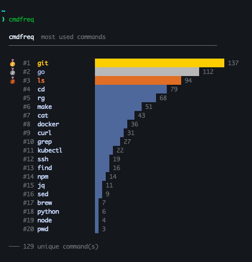

# cmdfreq

A CLI tool that analyzes your shell history and shows a ranked summary of your most-used commands.

## Installation

### Install script

Run one command:

```sh
curl -fsSL https://raw.githubusercontent.com/codestutis/cmdfreq/main/install.sh | sh
```

The installer supports Bash and Zsh on macOS, Linux, and WSL. It:

- installs `cmdfreq` to `$HOME/.local/bin`;
- adds that directory to `PATH`;
- configures persistent, shared shell history; and
- sets a default history file when `HISTFILE` is not already configured.

Open a new terminal after installation.

Shell settings are stored in `${XDG_CONFIG_HOME:-$HOME/.config}/cmdfreq/bashrc` or `zshrc`. The installer adds one marked source block to the relevant startup files. Before changing an existing startup file, it saves the original as `<file>.cmdfreq.bak`; an existing backup is never overwritten. Re-running the installer is safe and does not duplicate configuration.

To install a specific version:

```sh
curl -fsSL https://raw.githubusercontent.com/codestutis/cmdfreq/main/install.sh | VERSION=v0.4.0 sh
```

To use a custom installation directory:

```sh
curl -fsSL https://raw.githubusercontent.com/codestutis/cmdfreq/main/install.sh | BIN_DIR="$HOME/bin" sh
```

The custom directory is added to `PATH` by the generated shell configuration.

Native Windows is not supported; use WSL with Bash or Zsh history.

### Go install

```sh
go install github.com/codestutis/cmdfreq@latest
```

When installed this way, ensure the Go binary directory is on `PATH`. `cmdfreq` uses `HISTFILE` when set and otherwise detects the standard Bash or Zsh history file.

## Usage

```sh
cmdfreq [-n count] [--resolve-aliases] [<command>]
```

- Displays your top 20 most-used commands by default, ranked by frequency.
- Use `-n` to choose how many results to show.
- Use `--resolve-aliases` to count aliases as the commands they expand to.
- `cmdfreq git` shows the most-used arguments to `git`.
- `cmdfreq -n 10 git` shows the top 10 most-used arguments to `git`.

## Example output


