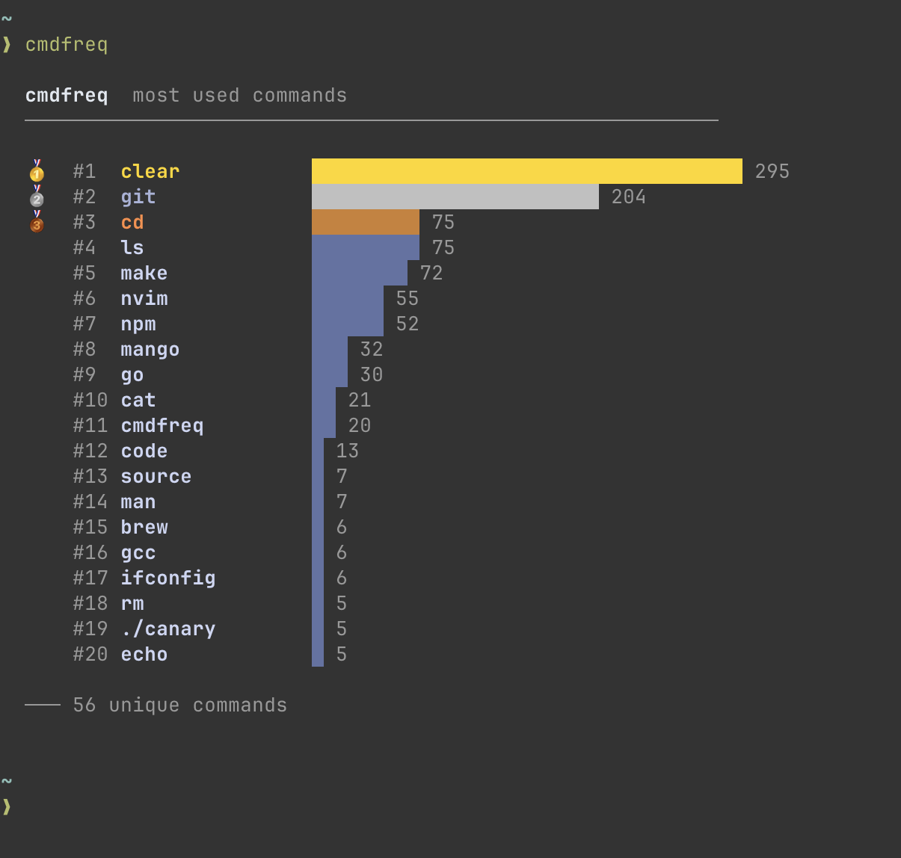

# cmdfreq
- a CLI tool that analyzes you shell history and shows a ranked summary of your most used commands
## Requirements
- go - you must have go installed on your system to be able to install this command
- setup - follow the setup instructions below for it to function properly
## Setup
add the following to your ~/.zshrc
```zsh
setopt INC_APPEND_HISTORY 
setopt SHARE_HISTORY # shares history between terminal windows and tmux sessions
export HISTFILE=~/.zsh_history # any file name will work
HISTSIZE=10000
SAVEHIST=10000
# if GOBIN is not already in your PATH
export PATH="$PATH:$(go env GOPATH)/bin"
```
> [!WARNING]
> if you use bash you will need to change `setopt` to `set -o`

then reload your config
```bash
source ~/.zshrc
```

## Installation
```bash
go install github.com/codestutis/cmdfreq@latest
```
## Usage
```bash
cmdfreq [<command>]
```
- Displays your top 20 most used commands, ranked by frequency
- Ex: `cmdfreq git` will output the most used arguments to the git command
## Example Output

